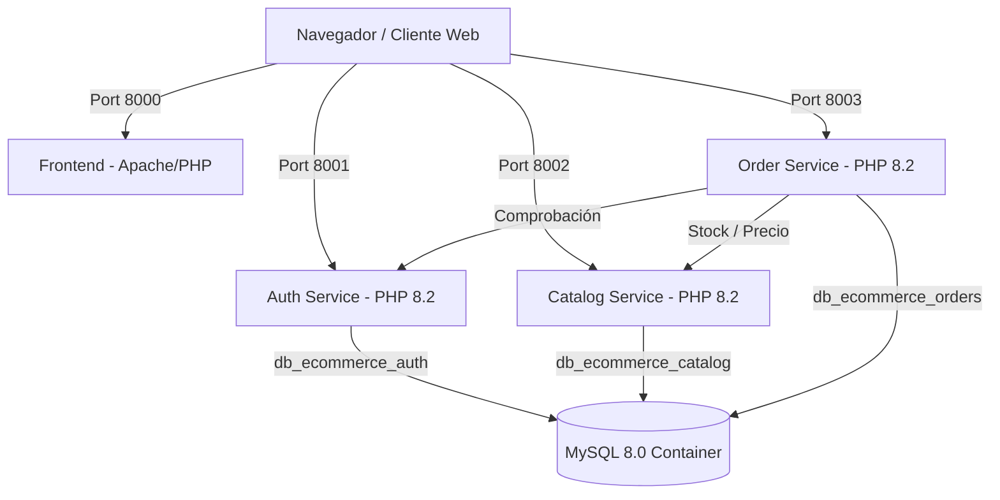

# 🛒 UniSur eShop - Plataforma de Comercio Electrónico basada en Microservicios

Bienvenido a **UniSur eShop**, un sistema completo de comercio electrónico estructurado bajo una **arquitectura de microservicios** utilizando **PHP 8.2 (Apache)**, **MySQL 8.0** y **Docker / Docker Compose**.

---

## 📌 Tabla de Contenidos
- [Características del Sistema](#-características-del-sistema)
- [Arquitectura del Proyecto](#-arquitectura-del-proyecto)
- [Estructura del Repositorio](#-estructura-del-repositorio)
- [Tecnologías Utilizadas](#-tecnologías-utilizadas)
- [Requisitos Previos](#-requisitos-previos)
- [Despliegue con Docker](#-despliegue-con-docker)
- [Puertos y Microservicios](#-puertos-y-microservicios)
- [Credenciales y Datos de Prueba](#-credenciales-y-datos-de-prueba)
- [Detalle de la Base de Datos](#-detalle-de-la-base-de-datos)

---

## ✨ Características del Sistema

- **Gestión de Autenticación y Usuarios**: Registro, inicio de sesión y validación de tokens de sesión con roles (`cliente` y `administrador`).
- **Catálogo de Productos**: Organización de productos por categorías, control de stock, precios y SKUs.
- **Gestión de Pedidos**: Procesamiento de compras, verificación de stock, cálculo de subtotal, impuestos y totales.
- **Interfaz Frontend**: Cliente ligero desacoplado para interactuar de forma transparente con la API de microservicios.
- **Contenerización Total**: Fácil configuración del entorno mediante Docker y auto-inicialización de base de datos MySQL.

---

## 📐 Arquitectura del Proyecto

El sistema se compone de tres microservicios principales, un microservicio para la interfaz web y un contenedor de base de datos MySQL unificado con múltiples esquemas.



---

## 📂 Estructura del Repositorio

```text
eShop/
├── Dockerfile                  # Configuración de imagen PHP 8.2 + Apache con pdo_mysql
├── docker-compose.yml          # Orquestación de servicios y contenedores
├── README.md                   # Documentación principal del proyecto
├── db-init/
│   └── init.sql                # Script de inicialización con esquemas y semillas
├── frontend/                   # Interfaz de usuario (HTML / CSS / JS / PHP)
│   ├── index.html
│   └── js/
└── services/                   # Microservicios backend
    ├── auth-service/           # Microservicio de Autenticación
    │   ├── .htaccess
    │   ├── index.php
    │   ├── config/
    │   └── controllers/
    ├── catalog-service/        # Microservicio de Catálogo de Productos
    │   ├── .htaccess
    │   ├── index.php
    │   ├── config/
    │   └── controllers/
    └── order-service/          # Microservicio de Gestión de Pedidos
        ├── .htaccess
        ├── index.php
        ├── config/
        └── controllers/
```

---

## 🛠️ Tecnologías Utilizadas

- **Lenguaje Principal Backend**: PHP 8.2
- **Servidor Web**: Apache (con `mod_rewrite` habilitado)
- **Base de Datos**: MySQL 8.0 (Motor InnoDB, UTF-8 MB4)
- **Frontend**: HTML5, JavaScript, Vanilla CSS
- **Contenerización**: Docker & Docker Compose

---

## 📋 Requisitos Previos

Asegúrate de contar con los siguientes programas instalados en tu sistema:

- [Docker Desktop](https://www.docker.com/products/docker-desktop/) (o Docker Engine)
- [Docker Compose](https://docs.docker.com/compose/)
- [Git](https://git-scm.com/) (opcional, para clonación)

---

## 🚀 Despliegue con Docker

1. **Clonar o situarse en el directorio del proyecto**:
   ```bash
   cd /ruta/hacia/eShop
   ```

2. **Levantar los servicios con Docker Compose**:
   ```bash
   docker-compose up -d --build
   ```

3. **Verificar el estado de los contenedores**:
   ```bash
   docker-compose ps
   ```

4. **Detener los servicios cuando sea necesario**:
   ```bash
   docker-compose down
   ```

---

## 🔌 Puertos y Microservicios

| Servicio | Contenedor | Puerto Host | Descripción |
| :--- | :--- | :--- | :--- |
| **Frontend** | `unisur_frontend` | `http://localhost:8000` | Interfaz de usuario web |
| **Auth Service** | `unisur_auth_service` | `http://localhost:8001` | API de gestión de usuarios y autenticación |
| **Catalog Service** | `unisur_catalog_service` | `http://localhost:8002` | API de productos y categorías |
| **Order Service** | `unisur_order_service` | `http://localhost:8003` | API de órdenes y pedidos |
| **MySQL DB** | `unisur_mysql` | `localhost:3306` | Servidor de base de datos MySQL |

---

## 🔑 Credenciales y Datos de Prueba

El script `db-init/init.sql` inserta automáticamente los siguientes usuarios de prueba (la contraseña para ambos es `password123`):

| Rol | Correo Electrónico | Contraseña |
| :--- | :--- | :--- |
| **Cliente** | `juan.perez@example.com` | `password123` |
| **Administrador** | `admin@unisur.edu.mx` | `password123` |

### Datos de Base de Datos (Interno / Docker Compose):
- **Host**: `mysql` (o `localhost` desde la máquina host en el puerto `3306`)
- **Usuario Root**: `root`
- **Contraseña Root**: `root_password`

---

## 🗄️ Detalle de la Base de Datos

El contenedor MySQL administra 3 bases de datos desacopladas:

1. **`db_ecommerce_auth`**:
   - `usuarios`: `id_usuario`, `nombre_completo`, `correo_electronico`, `password_hash`, `rol`, `token_sesion`, `fecha_creacion`.
2. **`db_ecommerce_catalog`**:
   - `categorias`: `id_categoria`, `nombre`, `descripcion`.
   - `productos`: `id_producto`, `id_categoria`, `sku`, `nombre_producto`, `descripcion`, `precio`, `stock_disponible`, `activo`.
3. **`db_ecommerce_orders`**:
   - `pedidos`: `id_pedido`, `id_usuario`, `fecha_pedido`, `estado`, `subtotal`, `impuesto`, `total`, `direccion_envio`.
   - `detalle_pedidos`: `id_detalle`, `id_pedido`, `id_producto`, `sku_producto`, `cantidad`, `precio_unitario`, `subtotal_linea`.

---

## 📄 Licencia

Este proyecto ha sido desarrollado como parte del ecosistema académico/técnico de UniSur. Todos los derechos reservados.
